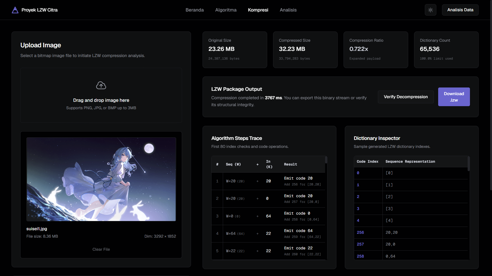
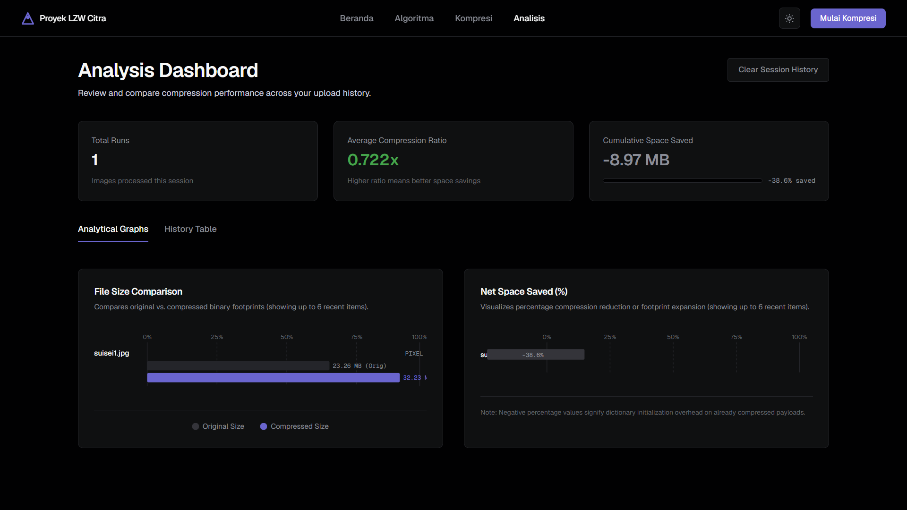

# LZW Image Compression Analyzer

Proyek ini merupakan aplikasi berbasis Next.js yang dirancang untuk melakukan analisis kompresi dan dekompresi citra menggunakan algoritma LZW (Lempel-Ziv-Welch). Aplikasi ini dikembangkan sebagai bagian dari tugas mata kuliah Pengolahan Citra untuk memvisualisasikan bagaimana algoritma kompresi berbasis kamus bekerja secara lossless pada data citra.

## Pratinjau Aplikasi

Berikut adalah tampilan antarmuka dari LZW Image Compression Analyzer:





---

## Latar Belakang Proyek

Kompresi citra merupakan aspek penting dalam pengolahan citra digital untuk mengefisiensikan penggunaan ruang penyimpanan dan mempercepat transfer data. Secara umum, kompresi dibagi menjadi dua kategori: lossy (mengurangi kualitas demi ukuran yang jauh lebih kecil) dan lossless (mempertahankan data asli secara utuh).

Proyek ini berfokus pada metode kompresi **lossless**, khususnya menggunakan algoritma **LZW (Lempel-Ziv-Welch)**. Aplikasi ini dirancang agar mahasiswa maupun praktisi dapat:
1. Memahami proses kompresi secara visual langkah demi langkah.
2. Membandingkan performa kompresi antara mode piksel mentah (RGBA) dengan mode byte biner file asli.
3. Melakukan verifikasi integritas data hasil dekompresi untuk membuktikan sifat lossless dari algoritma LZW.

---

## Penjelasan Algoritma LZW

Algoritma LZW adalah metode kompresi berbasis kamus (dictionary-based compression). Alih-alih melakukan enkoding pada karakter tunggal, LZW mengidentifikasi pola atau rangkaian data yang berulang dan menggantikannya dengan kode indeks yang lebih ringkas.

### Cara Kerja Kompresi LZW

1. **Inisialisasi Kamus:**
   Kamus diawali dengan mendaftarkan semua karakter atau nilai byte dasar. Untuk data byte citra, kamus diisi dengan nilai byte 0 sampai 255 (representasi ASCII/byte dasar). Indeks berikutnya (dimulai dari 256) disediakan untuk rangkaian byte baru yang ditemukan selama proses kompresi.

2. **Pembacaan Sekuensial:**
   Algoritma membaca data masukan byte demi byte:
   * Misalkan `W` adalah rangkaian byte saat ini (diinisialisasi dengan byte pertama).
   * Baca byte berikutnya dari masukan, sebut saja `K`.
   * Gabungkan keduanya menjadi rangkaian baru `W + K`.

3. **Pemeriksaan Kamus:**
   * Jika `W + K` sudah ada di dalam kamus, perbarui rangkaian aktif menjadi `W = W + K`. Proses dilanjutkan ke byte berikutnya.
   * Jika `W + K` belum ada di dalam kamus:
     * Keluarkan kode indeks dari `W` ke dalam aliran output terkompresi.
     * Masukkan rangkaian baru `W + K` ke dalam kamus dengan kode indeks baru yang tersedia (misalnya 256, 257, dst.).
     * Setel ulang rangkaian aktif menjadi `W = K`.

4. **Terminasi:**
   Setelah semua byte terbaca, keluarkan kode indeks dari rangkaian sisa `W` ke aliran output.

### Keunggulan LZW pada Citra

LZW sangat efektif digunakan pada citra yang memiliki banyak area dengan warna homogen (pixel berulang), seperti grafik komputer, ikon, dan diagram. Karena tidak ada data visual yang dibuang atau diubah (bit-for-bit identical), hasil rekonstruksi setelah dekompresi akan 100% sama persis dengan citra aslinya. Algoritma ini merupakan standar industri di balik format berkas **GIF** dan opsi kompresi lossless pada berkas **TIFF**.

---

## Fitur Utama Aplikasi

1. **Upload Citra Interaktif:**
   Mendukung pengunggahan berkas citra format PNG, JPG, dan BMP secara langsung atau melalui drag-and-drop.

2. **Dua Mode Kompresi:**
   * **Raw Pixels (RGBA):** Mengekstrak data piksel mentah (red, green, blue, alpha) dari kanvas citra untuk dikompresi. Mode ini menghasilkan rasio kompresi tinggi pada gambar dengan area warna datar yang luas.
   * **File Binary Bytes:** Membaca bytes berkas mentah langsung dari penyimpanan. Membantu memberikan pemahaman mengapa kompresi LZW pada berkas yang sudah terkompresi sebelumnya (seperti PNG atau JPG terkompresi) justru dapat memperbesar ukuran berkas.

3. **Metrik Performa Real-Time:**
   Menyajikan data ukuran berkas awal, ukuran berkas hasil kompresi, rasio kompresi (x-times), jumlah entri kamus yang terpakai, dan waktu pemrosesan dalam milidetik.

4. **Visualisasi Langkah Algoritma (Step-by-Step Trace):**
   Menampilkan log proses langkah demi langkah dari jalannya algoritma LZW, memudahkan analisis akademis mengenai kapan kamus diisi dan kode apa yang dikeluarkan.

5. **Inspektur Kamus (Dictionary Inspector):**
   Melihat tabel pemetaan indeks kamus dinamis yang terbentuk selama encoding data citra berlangsung.

6. **Verifikasi Dekompresi:**
   Fitur untuk mendekodekan kembali data terkompresi ke bentuk aslinya secara langsung di browser dan membandingkannya secara otomatis untuk memvalidasi keberhasilan restorasi citra.

7. **Unduh Output Kompresi:**
   Dapat mengekspor hasil kompresi ke berkas berformat biner kustom `.lzw`.

---

## Spesifikasi Teknis

* **Framework:** Next.js 16 (App Router)
* **Bahasa Pemrograman:** TypeScript
* **Styling:** TailwindCSS
* **Target Environment:** Client-side execution (pemrosesan kompresi dilakukan secara lokal di browser pengguna tanpa memerlukan server pemrosesan eksternal).

---

## Panduan Menjalankan Aplikasi Secara Lokal

### Prasyarat
Pastikan Anda sudah menginstal Node.js (versi 18 ke atas) dan paket manajer `pnpm` (atau `npm` / `yarn`).

### Langkah Instalasi

1. **Unduh atau klon repositori proyek.**

2. **Instal dependensi proyek:**
   ```bash
   pnpm install
   # atau jika menggunakan npm:
   npm install
   ```

3. **Jalankan server pengembangan lokal:**
   ```bash
   pnpm run dev
   # atau jika menggunakan npm:
   npm run dev
   ```

4. **Buka aplikasi di browser:**
   Akses alamat [http://localhost:3000](http://localhost:3000).

5. **Membuat production build:**
   ```bash
   pnpm run build
   pnpm run start
   ```
